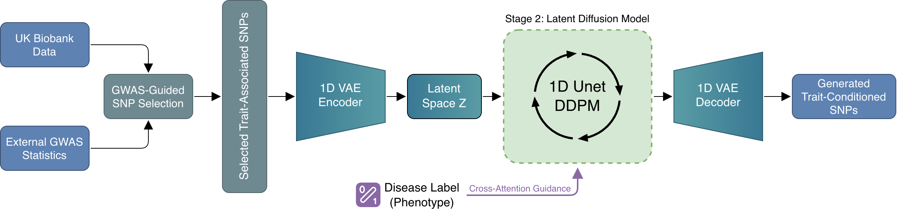

# SNPgen

[](LICENSE)
[](https://www.python.org/downloads/)
[](https://pytorch.org/)

**Phenotype-supervised genotype representation and synthetic data generation via latent diffusion.**

SNPgen is a two-stage generative framework for creating realistic synthetic SNP genotype data conditioned on phenotypic traits. It combines a Variational Autoencoder (VAE) for compressed genotype representation with a latent Denoising Diffusion Probabilistic Model (DDPM) for phenotype-conditioned synthetic data generation.

This project has been developed and tested on [UK Biobank](https://www.ukbiobank.ac.uk/) data, but the framework is designed to work with other biobanks and GWAS datasets as well.

## Method Overview



### Stage 1: VAE (Compression)
A 1D convolutional VAE (adapted from the Stable Diffusion encoder/decoder architecture) compresses one-hot encoded SNP sequences `[B, 3, L]` into a compact latent space `[B, 1, L/16]`, achieving 16x compression. An adversarial discriminator loss improves reconstruction fidelity.

### Stage 2: Latent Diffusion (Generation)
A 1D UNet (adapted from Stable Diffusion) performs denoising diffusion in the VAE's latent space. Phenotype labels are injected via cross-attention conditioning with classifier-free guidance. New genotypes are generated by sampling noise, denoising with the UNet, and decoding through the VAE decoder.

## Installation

### Requirements
- Python 3.10+
- CUDA-capable GPU (A100/H100 recommended)

### Setup

```bash
# Clone the repository
git clone https://github.com/ht-diva/SNPgen.git
cd SNPgen

# Create a conda environment (recommended)
conda create -n snpgen python=3.10
conda activate snpgen

# Install dependencies
pip install -r requirements.txt
```

## Data Format

SNPgen expects data in HDF5 format with the following structure:

| Key | Shape | Type | Description |
|-----|-------|------|-------------|
| `data` | `(N, 3, L)` | float32 | One-hot encoded SNPs: channels = {hom-ref, het, hom-alt} |
| `labels` | `(N,)` | int | Phenotype labels (e.g., 0=control, 1=case) |
| `snp_ids` | `(L,)` | string | SNP identifiers (e.g., rs numbers) |

Use the `BED to HDF5.ipynb` notebook to convert PLINK BED files to the required format. The input BED file should already contain LD-clumped SNPs. The notebook handles:
- Ancestry/ethnicity filtering
- GWAS allele alignment and beta flipping
- Optional top-K SNP selection by GWAS p-value
- Saving to HDF5 with SNP metadata (betas, p-values, alleles, chromosomal positions)

## Configuration System

SNPgen uses YAML configs with OmegaConf for all model parameters. Configs are hierarchical and composable:

```
configs/
├── vae/
│   ├── base.yaml          # VAE training base config
│   ├── base_disc.yaml     # + adversarial discriminator
│   └── encoder/           # Encoder size variants
│       ├── base.yaml      # Default (embed_dim=128)
│       ├── small_emb64.yaml
│       ├── small_emb128.yaml
│       └── ...
└── ddpm/
    ├── base.yaml          # DDPM training base config
    └── encoder/
        └── base.yaml      # DDPM first-stage config (VAE checkpoint)
```

All models are instantiated via `instantiate_from_config()` — class targets and parameters are specified entirely in YAML.

## Workflow

The complete pipeline follows these steps:

### 1. Data Preparation
```
Notebook: BED to HDF5.ipynb
GPU:      Not required
```
Convert PLINK BED genotype files + phenotype data into the HDF5 format. The input BED file should already contain LD-clumped SNPs; the notebook performs ancestry filtering, GWAS allele alignment, and optional top-K SNP selection by p-value.

### 2. Train VAE
```
Notebook: Train VAE.ipynb
Config:   configs/vae/base.yaml + configs/vae/base_disc.yaml + configs/vae/encoder/<size>.yaml
GPU:      Required
```
Train the VAE with adversarial loss. The base config is extended with the discriminator config and an encoder size variant. The best checkpoint is selected by validation reconstruction accuracy.

### 3. Train DDPM
```
Notebook: Train DDPM.ipynb
Config:   configs/ddpm/base.yaml + configs/ddpm/encoder/base.yaml
GPU:      Required
```
Train the latent diffusion model using the frozen VAE encoder. Requires specifying the VAE checkpoint path in the encoder config.

### 4. Generate Synthetic Data
```
Notebook: Synthetic Analysis.ipynb
GPU:      Required
```
Generate synthetic genotypes conditioned on phenotype labels. Supports matched sampling (same distribution as training data) and augmented sampling (class-balanced).

### 5. Evaluate Reconstructions
```
Notebook: Reconstructions Analysis.ipynb
GPU:      Required
```
Assess VAE reconstruction quality by encoding and decoding the original data.

### 6. Downstream Evaluation
```
Notebook: Train Classifier (Cross-Validation).ipynb
GPU:      Optional (speeds up XGBoost with GPU)
```
Train ML classifiers (XGBoost, PRS) on real, synthetic, and augmented data using 5-fold stratified cross-validation.

### 7. Privacy Assessment
```
Notebook: Privacy Analysis.ipynb
GPU:      Optional (speeds up kNN computations)
```
Evaluate privacy metrics: Identical Match Rate (IMR), Nearest Neighbor Distance Ratio (NNDR), Distance to Closest Record (DCR), Nearest Neighbor Adversarial Accuracy (NNAA), Membership Inference (MI), and MAF correlation.

## Project Structure

```
SNPgen/
├── snpgen/                     # Main package
│   ├── data/                   # Dataset classes and data utilities
│   │   ├── loader.py           # SplitDataset, SNPDataset, SNPSequenceDataset
│   │   └── utils.py            # Numba-accelerated data operations
│   ├── models/modules/
│   │   ├── vae/                # VAE components
│   │   │   ├── autoencoders.py # Autoencoder, IdentityAutoencoder
│   │   │   ├── encoders/sd.py  # Encoder (SD-style 1D CNN)
│   │   │   ├── decoders/sd.py  # Decoder (mirror architecture)
│   │   │   ├── discriminators.py # WDiscriminator (spectral norm)
│   │   │   ├── losses.py       # VAE + adversarial losses
│   │   │   └── layers.py       # ResNet blocks, attention, up/downsampling
│   │   ├── ddpm/               # Diffusion model components
│   │   │   ├── unet.py         # 1D UNet (adapted from SD)
│   │   │   ├── sampler.py      # EulerEDM sampler
│   │   │   ├── denoiser.py     # Denoiser with scaling/weighting
│   │   │   └── losses.py       # Diffusion loss
│   │   ├── attention/          # Multi-backend attention (Flash, xFormers, SDPA)
│   │   └── embedding/          # Label embedders for conditioning
│   ├── training/
│   │   ├── engine/             # Lightning training wrappers
│   │   │   ├── base.py         # BaseEngine (EMA, logging, LR scheduling)
│   │   │   ├── vae.py          # VAE + VAE-GAN training
│   │   │   └── ddpm.py         # DiffusionEngine
│   │   ├── callbacks/ema/      # EMA weight tracking
│   │   ├── metrics/            # Reconstruction accuracy, balanced accuracy
│   │   └── loggers/            # W&B logger wrapper
│   ├── inference/              # Generation and reconstruction pipelines
│   │   ├── generator.py        # SNPGenerator (end-to-end generation)
│   │   ├── reconstruction.py   # SNPReconstructor (encode-decode)
│   │   ├── label_samplers.py   # Matched/balanced label sampling
│   │   └── io.py               # Checkpoint + config loading
│   ├── evaluation/             # ML evaluation pipeline
│   │   ├── pipeline.py         # CrossValidationPipeline
│   │   ├── plotting.py         # Metrics visualization
│   │   ├── results.py          # Result aggregation
│   │   ├── trainers/           # XGBoost, CatBoost, RandomForest, PRS
│   │   └── privacy/            # Privacy metrics (IMR, NNDR, DCR, NNAA, MI)
│   └── utils/                  # Config loading, genotype utilities
├── configs/                    # YAML configuration files
├── *.ipynb                     # Jupyter notebooks (see Workflow above)
├── requirements.txt            # Python dependencies
├── LICENSE                     # MIT License
└── CITATION.cff                # Machine-readable citation
```

## Citation

If you use SNPgen in your research, please cite:

```bibtex
@article{lampis2026snpgen,
  title     = {SNPgen: Phenotype-Supervised Genotype Representation and Synthetic Data Generation via Latent Diffusion},
  author    = {Lampis, Andrea and Massi, Michela Carlotta and Matteucci, Matteo and Di Angelantonio, Emanuele},
}
```

## License

This project is licensed under the MIT License. See [LICENSE](LICENSE) for details.
