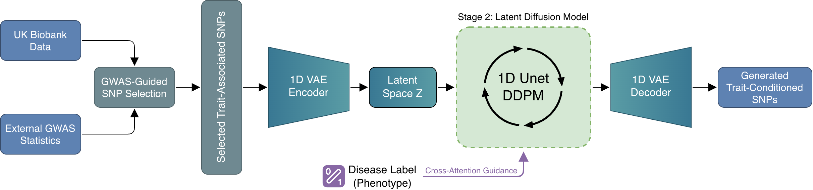

# SNPgen

[](LICENSE)
[](https://www.python.org/downloads/)
[](https://pytorch.org/)

**Official implementation of the paper ["SNPgen: Phenotype-Supervised Genotype Representation and Synthetic Data Generation via Latent Diffusion"](https://arxiv.org/abs/2603.10873) (arXiv 2026).**

SNPgen is a two-stage generative framework for creating realistic synthetic SNP genotype data conditioned on phenotypic traits. It combines a Variational Autoencoder (VAE) for compressed genotype representation with a latent Denoising Diffusion Probabilistic Model (DDPM) for phenotype-conditioned synthetic data generation.

This project has been developed and tested on [UK Biobank](https://www.ukbiobank.ac.uk/) data, but the framework is designed to work with other biobanks and GWAS datasets as well.

## Method Overview



### Stage 1: VAE (Compression)
A 1D convolutional VAE (adapted from the Stable Diffusion encoder/decoder architecture) compresses one-hot encoded SNP sequences `[B, 3, L]` into a compact latent space. The number of latent channels and the downsampling factor are configurable; the breast-cancer configuration uses four latent channels. An adversarial discriminator loss is used during training.

### Stage 2: Latent Diffusion (Generation)
A 1D UNet (adapted from Stable Diffusion) performs denoising diffusion in the VAE's latent space. Phenotype labels are injected via cross-attention conditioning with classifier-free guidance. New genotypes are generated by sampling noise, denoising with the UNet, and decoding through the VAE decoder.

## Installation

### Requirements
- Python 3.10+
- CUDA-capable GPU (A100/H100 recommended)

### Setup

```bash
# Clone the repository
git clone https://github.com/ht-diva/SNPgen.git
cd SNPgen

# Create a conda environment (recommended)
conda create -n snpgen python=3.10
conda activate snpgen

# Install dependencies
pip install -r requirements.txt
```

## Data Format

SNPgen expects data in HDF5 format with the following structure:

| Key | Shape | Type | Description |
|-----|-------|------|-------------|
| `data` | `(N, L)` | integer | Unphased diploid dosages in {0, 1, 2}; converted to one-hot tensors by the data loader |
| `labels` | `(N,)` | int | Phenotype labels (e.g., 0=control, 1=case) |
| `snp_ids` | `(L,)` | string | SNP identifiers (e.g., rs numbers) |

Use `bed_to_hdf5.py` to convert PLINK BED files to the required format. The input BED file should already contain LD-clumped SNPs. The command handles:
- Optional ancestry filtering using your sample metadata
- GWAS allele alignment and beta flipping
- Optional top-K SNP selection by GWAS p-value
- Saving to HDF5 with SNP metadata (betas, p-values, alleles, chromosomal positions)

Association and genotype-structure evaluation use the same variant order in real and synthetic data. LD-decay evaluation also requires per-variant chromosome and physical-position metadata (`chrom` and `pos`); see [the evaluation commands](ablation/README.md) for their input requirements.

## Configuration System

SNPgen uses YAML configs with OmegaConf for all model parameters. Configs are hierarchical and composable:

```
configs/
├── vae/
│   ├── base.yaml          # VAE training base config
│   ├── base_disc.yaml     # + adversarial discriminator
│   └── encoder/           # Encoder size variants
│       ├── base.yaml      # Default (embed_dim=128)
│       ├── small_emb64.yaml
│       ├── small_emb128.yaml
│       └── ...
└── ddpm/
    ├── base.yaml          # DDPM training base config
    └── encoder/
        └── base.yaml      # DDPM first-stage config (VAE checkpoint)
```

All models are instantiated via `instantiate_from_config()` — class targets and parameters are specified entirely in YAML.

## Workflow

Run the commands from the repository root after installing the dependencies.
Every entry point accepts `--help`; no script requires editing personal paths
or setting Slurm environment variables. Each root script follows the documented
pipeline sections and uses the project helpers. Training writes `config.yaml` beside
its checkpoints. Use explicit checkpoint filenames when moving between stages.
The [CLI guide](docs/cli.md) explains the input formats, configuration overrides,
output files and evaluation protocols.

### 1. Prepare data

```bash
python bed_to_hdf5.py --bed-prefix /path/to/selected_snps \
  --phenotype /path/to/phenotypes.csv --gwas /path/to/gwas.tsv \
  --output /path/to/genotypes.hdf5 --top-k 2048
```

GWAS column names and ethnicity filters are configurable. The phenotype CSV
uses the `f.eid,phenotype` format. The command aligns GWAS effects to the encoded
alleles and saves variant metadata for association and LD analysis. This example
writes both the full retained panel and `genotypes_top2048.hdf5`; use the latter
for the 2048-SNP training configuration.

### 2. Train the VAE

```bash
python train_vae.py \
  --config configs/vae/base.yaml --config configs/vae/encoder/base.yaml \
  --config configs/vae/encoder/small_emb128.yaml --config configs/vae/base_disc.yaml \
  --dataset-path /path/to/genotypes_top2048.hdf5 --output-dir /path/to/vae_run \
  --max-epochs 400 --accelerator gpu --devices 1
```

The default VAE checkpoint criterion is validation reconstruction accuracy.
For the breast-cancer panel, select 1024 SNPs during conversion and use that
selected-panel file with `--set seq_len=1024`,
`--set model.params.autoencoder_config.params.encoder_config.params.z_channels=4`
and `--set model.params.loss_config.params.kl_weight=0.1`.

### 3. Train the DDPM

```bash
python train_ddpm.py --vae-checkpoint /path/to/vae_run/best_checkpoint.ckpt \
  --output-dir /path/to/ddpm_run --max-epochs 1000 --accelerator gpu --devices 1
```

The DDPM inherits the VAE architecture, dataset and data split from its saved
configuration. Its checkpoint selection uses validation denoising loss, with
periodic snapshots also available. W&B logging is optional (`--wandb`); it is
disabled by default.

### 4. Generate matched and augmented genotypes

```bash
python generate_ddpm.py --checkpoint /path/to/ddpm_run/best_checkpoint.ckpt \
  --output-dir /path/to/generated --modes matched augmented --cfg-scale 5
```

Matched sampling retains the reference cohort's phenotype distribution;
augmented sampling generates a balanced cohort. Guidance scales, sampling steps, device and batch size are configurable.
Cohort sizes follow the matched and balanced label-sampling definitions. Outputs are saved as
`syn_complete_dataset.hdf5` and `syn_augmented_dataset.hdf5`. Existing datasets
require `--overwrite` to replace them or `--skip-existing` to keep them.

### 5. Generate VAE reconstructions

```bash
python reconstruct_vae.py --checkpoint /path/to/vae_run/best_checkpoint.ckpt \
  --output-dir /path/to/reconstructions --splits train_val test
```

Posterior sampling is the default; `--posterior-mean` uses the encoder mean.
Optional latent and original-data storage supports representation diagnostics.
The test reconstructions are diagnostic outputs and must not be used to train
a downstream predictor evaluated on those same real test records.

### 6. Evaluate downstream utility

```bash
python evaluate_downstream.py --config /path/to/ddpm_run/config.yaml \
  --complete-path /path/to/generated/syn_complete_dataset.hdf5 \
  --augmented-path /path/to/generated/syn_augmented_dataset.hdf5 \
  --synthetic-types complete augmented --output-dir /path/to/utility \
  --models xgboost xgboost_balanced prs --n-folds 5 --plot
```

Models fitted on real or generated data are evaluated on an independent real
test set. Classifier tuning uses only the fitting data. Reconstructed-data
evaluation is available with an explicit reconstruction path and source split.
Results are saved as pickles; optional plots include
fold variation and the external GWAS PRS reference when betas are present.

### 7. Evaluate privacy

```bash
python evaluate_privacy.py --config /path/to/ddpm_run/config.yaml \
  --syn-path /path/to/generated/syn_complete_dataset.hdf5 \
  --output-dir /path/to/privacy --model-name SNPgen
```

This evaluates IMR, NNDR, DCR, NNAA, membership inference and allele-frequency
correlation, plus the Yelmen-compatible AA and chain diagnostics. Fitting
records are members, and the independent real test split is the holdout.
Class-specific results and diagnostic plots are included; reconstruction
analysis runs when reconstruction data are available and can be disabled.

### Additional generators and evaluations

The [comparison and ablation suite](ablation/README.md) provides training,
checkpoint selection and generation for an architecture-matched conditional
VAE and our phenotype-conditioned CRBM and WGAN-GP adaptations. It also provides
association calibration, genotype-structure diagnostics and label controls.

Its [Slurm templates](ablation/slurm/) use configurable scheduler and Python
settings. `submit_ddpm_evaluation.sh` accepts an explicit run list for DDPM
generation and subsequent utility/privacy evaluation; `--dry-run` prints the
commands without submitting jobs.

## Project Structure

```
SNPgen/
├── snpgen/                     # Main package
│   ├── data/                   # Dataset classes and data utilities
│   │   ├── loader.py           # SplitDataset, SNPDataset, SNPSequenceDataset
│   │   └── utils.py            # Numba-accelerated data operations
│   ├── models/modules/
│   │   ├── vae/                # VAE components
│   │   │   ├── autoencoders.py # Autoencoder, IdentityAutoencoder
│   │   │   ├── encoders/sd.py  # Encoder (SD-style 1D CNN)
│   │   │   ├── decoders/sd.py  # Decoder (mirror architecture)
│   │   │   ├── discriminators.py # WDiscriminator (spectral norm)
│   │   │   ├── losses.py       # VAE + adversarial losses
│   │   │   └── layers.py       # ResNet blocks, attention, up/downsampling
│   │   ├── ddpm/               # Diffusion model components
│   │   │   ├── unet.py         # 1D UNet (adapted from SD)
│   │   │   ├── sampler.py      # EulerEDM sampler
│   │   │   ├── denoiser.py     # Denoiser with scaling/weighting
│   │   │   └── losses.py       # Diffusion loss
│   │   ├── attention/          # Multi-backend attention (Flash, xFormers, SDPA)
│   │   └── embedding/          # Label embedders for conditioning
│   ├── training/
│   │   ├── engine/             # Lightning training wrappers
│   │   │   ├── base.py         # BaseEngine (EMA, logging, LR scheduling)
│   │   │   ├── vae.py          # VAE + VAE-GAN training
│   │   │   └── ddpm.py         # DiffusionEngine
│   │   ├── callbacks/ema/      # EMA weight tracking
│   │   ├── metrics/            # Reconstruction accuracy, balanced accuracy
│   │   └── loggers/            # W&B logger wrapper
│   ├── inference/              # Generation and reconstruction pipelines
│   │   ├── generator.py        # SNPGenerator (end-to-end generation)
│   │   ├── reconstruction.py   # SNPReconstructor (encode-decode)
│   │   ├── label_samplers.py   # Matched/balanced label sampling
│   │   └── io.py               # Checkpoint + config loading
│   ├── evaluation/             # ML evaluation pipeline
│   │   ├── pipeline.py         # CrossValidationPipeline
│   │   ├── plotting.py         # Metrics visualization
│   │   ├── results.py          # Result aggregation
│   │   ├── trainers/           # XGBoost, CatBoost, RandomForest, PRS
│   │   └── privacy/            # Privacy metrics (IMR, NNDR, DCR, NNAA, MI)
│   └── utils/                  # Config loading, genotype utilities
├── configs/                    # YAML configuration files
├── ablation/                   # Additional generators, evaluation CLI, tests and Slurm templates
├── *.py                        # Command-line entry points (see Workflow above)
├── requirements.txt            # Python dependencies
├── LICENSE                     # MIT License
└── CITATION.cff                # Machine-readable citation
```

## Citation

If you use SNPgen in your research, please cite:

```bibtex
@misc{lampis2026snpgenphenotypesupervisedgenotyperepresentation,
      title={SNPgen: Phenotype-Supervised Genotype Representation and Synthetic Data Generation via Latent Diffusion}, 
      author={Andrea Lampis and Michela Carlotta Massi and Nicola Pirastu and Francesca Ieva and Matteo Matteucci and Emanuele Di Angelantonio},
      year={2026},
      eprint={2603.10873},
      archivePrefix={arXiv},
      primaryClass={cs.LG},
      url={https://arxiv.org/abs/2603.10873}, 
}
```

## License

This project is licensed under the MIT License. See [LICENSE](LICENSE) for details.
